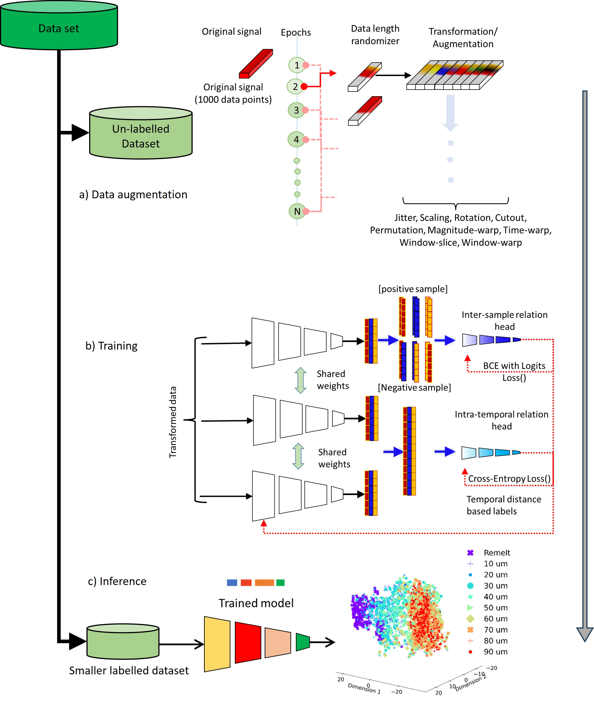

# 🧠 Additive-Manufacturing-Optical-Variable-Timescales

**Adaptive In-Situ Monitoring for Laser Powder Bed Fusion (LPBF):  
Self-Supervised Learning for Layer Thickness Monitoring Across Scan Lengths based on Pyrometry**

---

## 📘 Overview

Laser Powder Bed Fusion (LPBF) is a widely used additive manufacturing process that offers high precision and design flexibility but suffers from quality inconsistencies due to variations in **layer thickness**.  
Ensuring uniform layer thickness is critical, as deviations can lead to **porosity, keyholing, and geometric distortion**.  

This repository introduces a **self-supervised machine learning framework** leveraging **on-axis pyrometry** to infer local layer thickness variations in LPBF.  
A **Temporal Convolutional Network (TCN)** is trained using a custom **temporal randomization technique** to handle variable-length time-series signals without requiring labelled data, addressing one of the key challenges in real-time process monitoring.

The model was experimentally validated on a controlled LPBF setup with varying layer thicknesses, demonstrating the ability to detect process anomalies such as **short-feeding** and **warping**.  
Dimensionality reduction using **t-SNE** revealed well-separated clusters across thickness regimes, confirming the model’s ability to extract physically meaningful embeddings.

---

## 🧩 Key Contributions

1. **Self-Supervised Framework for In-Situ Monitoring**  
   - Introduces a self-supervised TCN capable of inferring local layer thickness directly from high-frequency, unlabeled pyrometer data.  
   - Eliminates the need for manual annotations or post-process characterization, significantly reducing data preparation costs.

2. **Temporal Sampling for Variable Scan Vectors**  
   - Implements a novel **temporal sampling and randomization algorithm** to handle variable-length scan vectors, ensuring robustness to complex toolpaths and geometries.

3. **Real-Time Layer Thickness Detection**  
   - The model detects layer-wise deviations with a resolution of ~20 µm in real-time (≤ 1.5 ms inference).  
   - Highlights the limitation of single-sensor setups and demonstrates the necessity of **sensor fusion** (pyrometry + IR + optical).

4. **Implicit Learning of Melt Pool Physics**  
   - The TCN encoder naturally organizes its latent feature space according to layer thickness, capturing **melt pool physics** without explicit governing equations.

---

## ⚙️ Methodology

The methodology integrates **signal acquisition**, **temporal encoding**, and **self-supervised training**:

1. **Signal Acquisition** – Pyrometer signals (2–2.2 µm, 100 kHz) recorded during LPBF scanning.  
2. **Data Randomization** – Variable window extraction (500–1000 samples) and time-series augmentations (jitter, scaling, cutout, magnitude/time-warp).  
3. **Temporal Encoder (TCN)** – Learns representations invariant to scan length.  
4. **Inter-sample & Intra-temporal Heads** – Contrastive objectives linking augmented signal pairs and temporal segments.  
5. **Inference & Visualization** – Latent embeddings analyzed with **t-SNE**, **centroid distances**, and **anomaly detection**.

### 🖼️ Proposed Framework



---

## 🧪 Experimental Setup

- **Machine:** Aconity3D Midi+ (500 W fiber laser, 1080 nm, 80 µm spot size)  
- **Material:** Stainless Steel 316L (15–45 µm particle size)  
- **Build Strategy:** Serpentine hatching, 100 µm hatch spacing, 150 W laser power, 800 mm/s scan speed  
- **Layer Heights:** 10 µm – 110 µm in 10 µm increments  
- **Sampling Rate:** 100 kHz on pyrometer and trigger channels  
- **Data Size:** ~49 000 waveform windows, 11 thickness regimes  

The dataset captures variable-length pyrometer emissions synchronized with the laser trigger signal, covering a wide range of process conditions for generalizable model training.

---

## 📦 Repository Structure

```bash
📂 Additive-Manufacturing-Optical-Variable-Timescales
├── Augmentation_Plots/ # Augmented waveform visualizations
├── Centroid_calculation/ # Centroid distance & t-SNE analysis
├── Dataloader/ # Temporal randomizer & window generator
├── Dataset/ # Experimental pyrometer datasets
├── Evaluation/ # Inference and anomaly detection scripts
├── Figures/ # Methodology and results figures
├── Model/ # TCN encoder and relation-heads architecture
├── Parser/ # Argument parsing & config setup
├── Trainer/ # Self-supervised model training scripts
├── Utils/ # Helper functions, logging, and metrics
├── Visualization/ # t-SNE, latent-space, and feature maps
├── Main.py # Entry point for training & evaluation
└── README.md 


## 🧠 Results Summary

Latent Embeddings:
t-SNE visualization shows distinct clustering across 11 layer thickness regimes.
Adjacent thicknesses exhibit smooth transitions, reflecting continuous melt pool dynamics.

Resolution Limit:
Discrimination between layers < 20 µm limited by pyrometer sensitivity; motivates sensor fusion.

Real-Time Feasibility:
Inference latency < 1.5 ms on RTX Titan GPU — suitable for real-time LPBF control.

## 🧬 Dataset Access

Zenodo Record: https://zenodo.org/records/11101714

## 🧩 Future Work

Integration of multi-sensor fusion (pyrometry + acoustic + optical + IR).

Deployment within real-time LPBF control loops.

Extension to multi-material builds and geometry-aware signal encoding.

Exploration of physics-informed learning and domain adaptation for cross-machine transfer.

## 📚 Citation

If you use this repository or data in your research, please cite:

Kavas, B., Richter, R. A., Tucker, M. R., & Pandiyan, V. (2025).
Adaptive In-Situ Monitoring for Laser Powder Bed Fusion: Self-Supervised Learning for Layer Thickness Monitoring Across Scan Lengths based on Pyrometry.
University of Turku / Empa / ETH Zürich.
DOI: 10.5281/zenodo.11101714


© 2025 Digital Manufacturing & Surface Engineering (DMS), University of Turku.